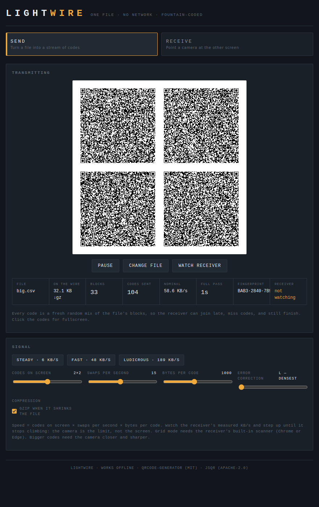
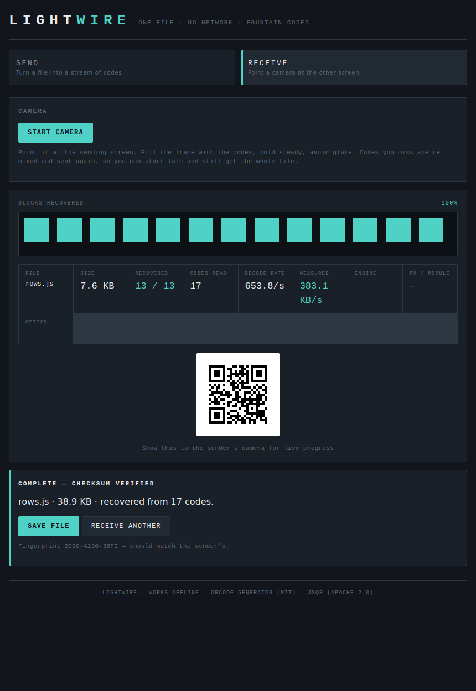
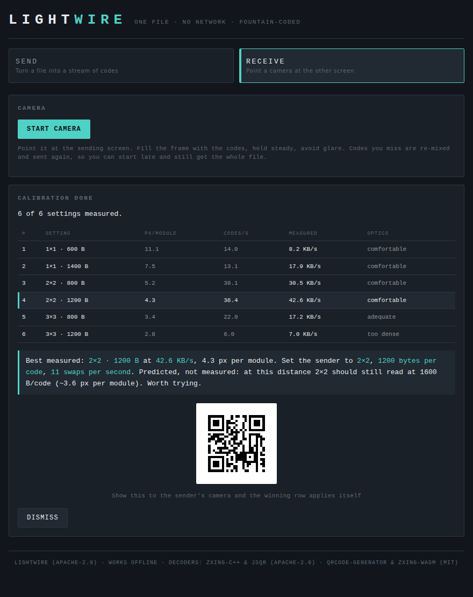

# Lightwire

A single HTML file that moves a file between two computers using nothing but a
screen and a camera. No network, no install, no server. Built for crossing an
air gap.

The sender turns a file into an endless stream of QR codes. The receiver points
a camera at that screen and reassembles the file. Because the codes are
**fountain-coded**, the receiver can join late, miss codes, blink, or lose focus
and still finish — there is no retransmission request, no handshake, and the
sender never needs to know what was missed.

```
dist/lightwire.html      ← the deliverable. Open it in a browser. That's it.
```

**[Download the latest release](https://github.com/SanketDube/lightwire/releases/latest)**
— one file, nothing to install. Copy it to both machines and open it.

**Status:** working on real hardware. Six measured transfers so far, up to
**300 MB** and a best of **90.0 KB/s**, checksums verified (`docs/CAMERA.md`).
The per-camera *forecast tables* in the docs are still forecasts and still say
so; one of them has already been retracted as too pessimistic. Download-only: there is no hosted demo, so
nobody is asked to trust a server for an air-gap tool.

> **Built by prompting, not by typing code.** I am not a programmer. Lightwire
> was designed and written by **Claude Code**, from my prompts, over a handful
> of sessions — the credit for the code belongs there. I started it because I
> went looking for a tool that did this well and could not find one.
> Full story at the bottom: [Who made this, and how](#who-made-this-and-how).

---

## What this actually does, in plain words

Say you have two computers that cannot talk to each other. Different networks.
No shared drive. No USB allowed, or no USB port you trust. One of them might
be deliberately kept off the internet — a machine holding keys, records, or
anything you would rather never touched a network.

You still need to get a file from one to the other.

**Lightwire does it with light.** The first computer turns your file into a
stream of flickering QR codes on its screen. The second computer watches that
screen through its webcam and rebuilds the file. Nothing is sent anywhere. The
only thing crossing the gap is light hitting a lens.

<p align="center">
  
  
</p>

*Left: the sending machine. Right: the receiving machine, done.*

### Why it does not break when the camera misses one

This is the part worth understanding, because it is what makes the thing usable.

A naive version would cut your file into numbered pieces and show them in a
loop: piece 1, piece 2, piece 3. Miss piece 47 and you have to wait for the
whole loop to come round again, and if the camera is unreliable you may never
get a clean set.

Lightwire never sends piece 47. **Every code on screen is a fresh scramble of
random pieces of the file mixed together** (the technique is called a *fountain
code*, and the mixing is why). Any large enough pile of these scrambles can be
untangled back into the original — it does not matter *which* ones you caught.

The consequences are the whole point:

- **You can start the camera late.** No beginning to miss.
- **Missed codes cost nothing.** Blink, cough, walk past — the next one is just
  as useful as the one you lost.
- **The sending machine never needs to hear back from you.** It cannot even tell
  whether anyone is watching. It just keeps pouring.

That is why the sending computer needs no camera, no network and no idea that
the receiver exists.

### Is it secure?

Two separate answers, and it matters not to blur them.

**No network.** True, and testable. There is not one line of code in it that
fetches anything. The whole app, including the barcode reader, is one file with
everything inlined, and a test in this repository blocks every outside request
and proves it still works.

**Encryption is optional and it is yours to turn on.** Type a passphrase on the
sending side and the file is locked with AES-256 before it is ever turned into
codes — even the filename is hidden inside the locked part. The receiver types
the same phrase to open it. Without a passphrase, anything on that screen is
readable by any camera in the room, which is exactly the situation encryption
exists for. Your passphrase is the whole of the security, so make it long.

### How fast?

Measured, not estimated: **90.0 KB/s** moving a 300 MB file on an ordinary
webcam, and 60.6 KB/s on a 12.8 MB one. Fast enough for documents, key files,
spreadsheets, archives. Not for video. The limit is the camera, not either
computer — and one adjustment mattered more than any setting: **focusing the
camera by hand** took the same transfer from 63.9 to 83.6 KB/s, because
autofocus hunts on a static screen.

Sizes: anything under **64 MB** just goes. Between 64 MB and **512 MB** it asks
first, telling you the wait and the memory it will need. Above that it refuses.
The ceiling is the *receiving* machine — it holds every code it has caught
until the end, which costs roughly four times the file size in memory, so
300 MB needs about 1.2 GB of browser to land.

You do not have to guess at your own camera. **Click "Send test signal"** and
it does two things. First it shows a steady pattern and waits, with no clock
running, while you aim: move the camera, change the angle, pin the focus, and
watch **px/module** respond on the receiving screen. That part matters more
than any setting — one focus adjustment was worth 31% on a real transfer. Then
press *Start sweep* and it walks eight settings, twelve seconds each, and you
can **hold** any of them while you keep adjusting. The receiving screen names
the winner in plain language and the sending screen gives you a button to adopt
it.

<p align="center">
  
</p>

*Every setting measured, ranked by what actually got through. The recommendation
at the bottom is written to be read, not decoded — and anything it guesses
rather than measured says so.*

### The whole thing, in five steps

1. Copy `lightwire.html` onto both computers. That one file is the entire
   program — there is nothing to install.
2. On the **receiving** computer, open it, go to *Receive* and start the camera.
3. On the **sending** computer, open it and click *Send test signal*. Aim the
   camera while it waits, then let it find your best setting. (Skippable, but
   do it the first time — it is where the speed comes from.)
4. Drag your file onto the sending window. Codes start flowing. Point the
   camera at that screen and fill the frame.
5. When it says **"Complete — checksum verified"**, the file has already saved
   itself. The checksum means it arrived byte for byte, not roughly.

One catch worth knowing up front: browsers only hand over a camera to a page
served over `https` or `localhost`, not to a file opened straight off the disk.
The *sending* machine is fine either way because it needs no camera. On the
*receiving* machine, see the note under Quickstart.

---

## Quickstart

**Sending machine:** open `dist/lightwire.html`, stay on the *Send* tab, drop a
file in. Codes start streaming immediately. Click *Send test signal* first if
you want the tool to pick your settings for you.

**Receiving machine:** open the same file, switch to *Receive*, click
*Start camera*, point it at the sending screen. Watch the estimated progress
bar climb. On completion the file downloads on its own; the *Save file* button
is there as a fallback.

**Camera access needs a secure context.** Chrome treats `file://` as secure for
crypto and hashing, but `getUserMedia` generally is not granted there. On the
receiving machine, serve it instead:

```bash
cd <folder containing lightwire.html>
python -m http.server 8000
# then open http://localhost:8000/lightwire.html
```

The sending machine can just double-click the file — it needs no camera.

## Repository layout

| Path | What it is |
|---|---|
| `dist/lightwire.html` | Built single-file app (~1.65 MB). The only thing an end user needs. |
| `src/core.js` | Codec: base45, CRC32, LT fountain encoder/decoder, container format, crypto/gzip helpers. Node-testable, no DOM. |
| `src/template.html` | UI + app logic, with `__PLACEHOLDER__` slots for the vendored libraries. |
| `src/assemble.py` | Build script. Inlines everything into `dist/lightwire.html`. |
| `src/vendor/` | Third-party libraries, vendored deliberately (see `docs/PUBLISHING.md`). |
| `tests/` | Node codec tests plus browser end-to-end tests (Puppeteer and Playwright). |
| `docs/` | Architecture, decision log, testing notes, camera theory, publishing analysis, handoff state. |
| `screenshots/` | Rendered UI states, captured from the headless test runs. |
| `LICENSE` · `NOTICE` · `THIRD-PARTY-NOTICES.md` | Apache-2.0, and the attribution every bundled component requires. |

## Building

```bash
cd src
python3 assemble.py     # writes ../dist/lightwire.html and test-copy.html
```

No npm install, no bundler, no network. The build is a string-substitution
script by design — see `docs/DECISIONS.md`.

## Speed, honestly

The presets are labelled with *nominal* rates — codes on screen × swaps per
second × bytes per code. Real throughput is lower and is set by the camera, not
the screen. A forecast for a Logitech C920 at 1080p puts the practical sweet
spot at **2×2 · 1200–1400 B, roughly 60–84 KB/s nominal**, with the 3×3
"Ludicrous" preset below the decodable pixel threshold on that sensor. See
`docs/CAMERA.md` for the arithmetic.

No optical figure here has been measured on real hardware yet. Rather than
publish a table of blessed webcams, the tool measures your own: **Send test
signal** runs a calibration sweep and tells you which settings your camera
actually sustains.

## Verifying what you downloaded

This is a security-adjacent tool, so check what you run. Every release publishes
the SHA-256 of its asset in the release notes. Compare before opening:

```bash
sha256sum lightwire.html
# v3.3.2: f64176623496e8af1ef435316d590dd5e795d42ae2aff699f8425e6239df2c85
```

Building from source reproduces the same file — `assemble.py` is string
substitution over the tracked inputs, with no network and no dependency
resolution.

## Licence

Lightwire is **Apache-2.0** — see `LICENSE`.

It embeds four third-party components, unmodified: **jsQR** and **ZXing-C++**
(Apache-2.0), **qrcode-generator** and **zxing-wasm** (MIT). Full texts,
copyright lines and the WASM provenance hash are in `THIRD-PARTY-NOTICES.md`,
and a condensed attribution block is embedded in `dist/lightwire.html` itself,
because that file is meant to travel alone.

No code was taken from any prior optical-transfer tool. The codec, base45
implementation, container format and wire protocol were written from scratch;
the projects that informed the design are credited under "Prior art" in
`THIRD-PARTY-NOTICES.md`.

## Who made this, and how

I am not a coder. I cannot write JavaScript, and I did not write any of this.

Every line in this repository was produced by **[Claude Code](https://claude.com/claude-code)**
working from my prompts — the codec, the fountain coding, the worker pipeline,
the barcode engine cascade, the tests, and most of these docs. My part was
deciding what it should do, saying when the answer was not good enough, and
knowing what "good enough" looked like. The engineering credit is Claude's.

I started it for the ordinary reason: **I went looking for a tool that moved a
file across an air gap with a screen and a camera, and everything I found was
worse than what I wanted.** Some needed an install. Some fell over the moment
the camera missed a frame. Some were a fork away from a licence I did not want.
So it got built instead.

Two things follow from that, and it is only fair to say them plainly:

- **Read the code before you trust it with anything that matters.** That advice
  is not special to this project, but it carries extra weight for a
  security-adjacent tool whose author cannot audit it line by line. What I can
  vouch for is stated as verified; what is a forecast is labelled a forecast,
  and the one real-hardware measurement is dated and separated from the
  arithmetic.
- **The reasoning is written down on purpose.** `docs/DECISIONS.md` records why
  things are the way they are, including what was tried and abandoned. If you
  are reviewing this, start there — it will tell you where the bodies are
  faster than the source will.

Issues and pull requests are welcome, especially from people who can actually
read the thing.

## Read this next

- **Taking over the project?** → `docs/HANDOFF.md`
- **Deciding whether/where to publish?** → `docs/PUBLISHING.md`
- **Need to understand or modify the protocol?** → `docs/ARCHITECTURE.md`
- **Wondering why something is the way it is?** → `docs/DECISIONS.md`
- **Tuning speed against a specific camera?** → `docs/CAMERA.md`
